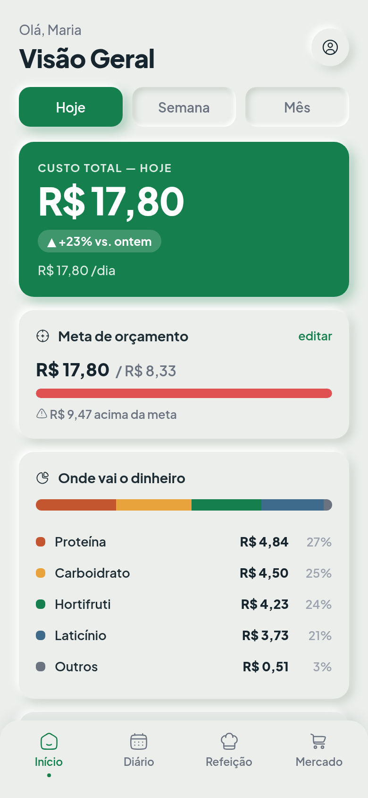
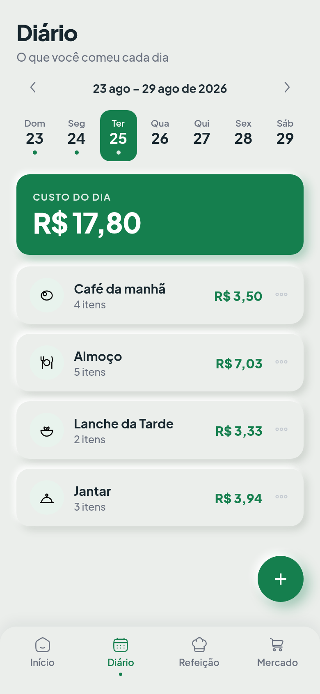
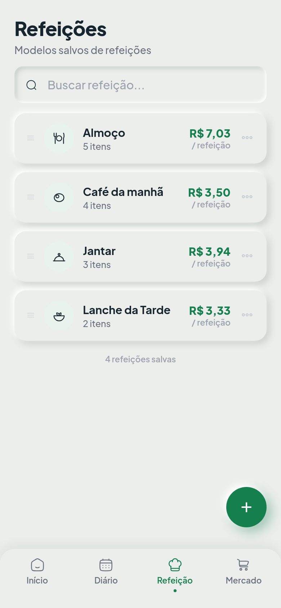
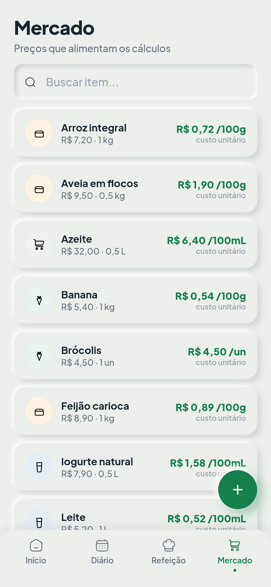
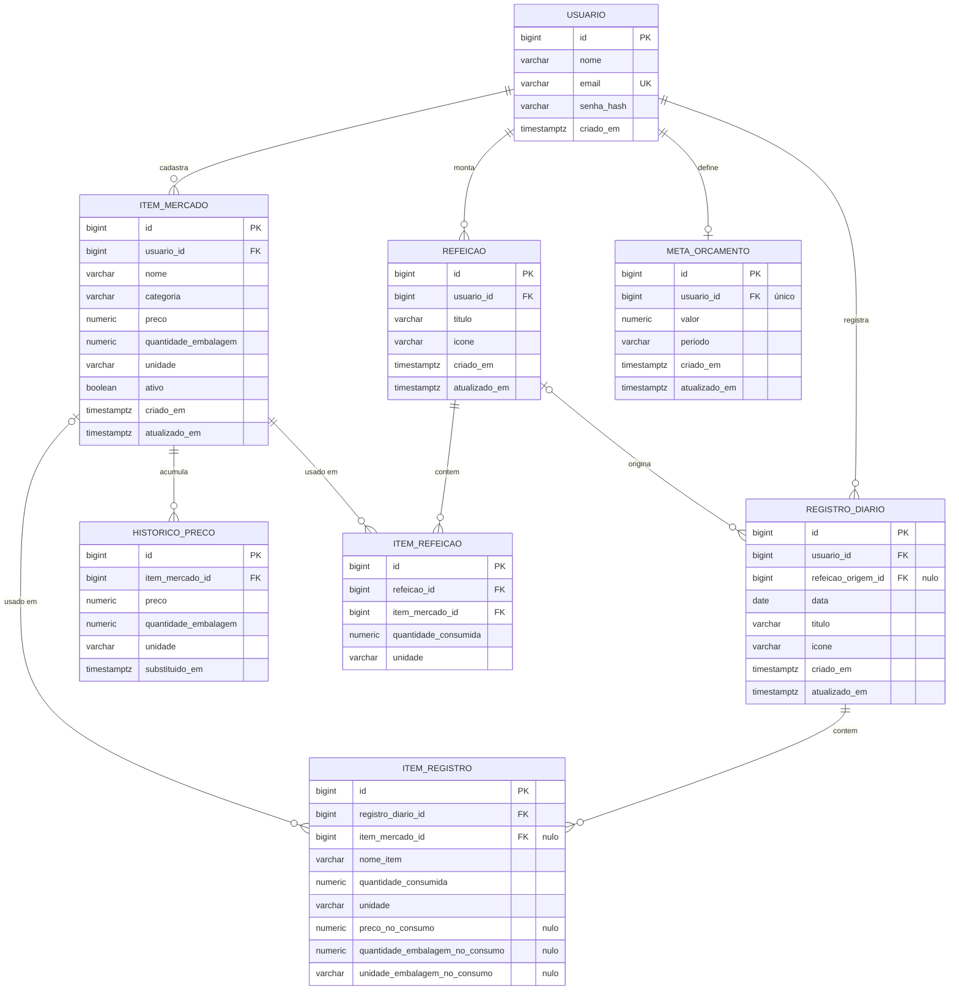

<div align="center">

# 🥗 MealMath

**Você sabe quanto gastou no mercado. Sabe quanto custou o seu almoço?**

[](https://openjdk.org/projects/jdk/17/)
[](https://spring.io/projects/spring-boot)
[](https://angular.dev)
[](https://www.postgresql.org/)


**[Guia de uso: instalar, rodar e desenvolver do zero](COMO-USAR.md)**

</div>

---

## O problema

Comida é um dos maiores gastos de uma casa e o único que se refaz três vezes por dia, mas o número
só aparece agregado — no extrato, com o mês já fechado. A conta não fecha na cabeça porque a
unidade da compra não é a unidade do prato: frango sai a R$ 18,90 o quilo e vira 150 g no almoço,
R$ 2,84. Multiplique por dez itens, cinco refeições e trinta dias.

O MealMath faz esse rateio e consolida o custo por refeição, por dia e por período, comparado com
o período anterior e com a meta. Apps de dieta cobrem a camada nutricional e ignoram a financeira;
apps de finanças param em "supermercado" como despesa única e nunca chegam ao prato.

## Telas

<table>
  <tr>
    <td align="center"><br><sub><b>Visão Geral</b><br>custo, meta e composição</sub></td>
    <td align="center"><br><sub><b>Diário</b><br>o que foi consumido no dia</sub></td>
    <td align="center"><br><sub><b>Biblioteca</b><br>refeições-modelo reutilizáveis</sub></td>
    <td align="center"><br><sub><b>Mercado</b><br>preços e histórico</sub></td>
  </tr>
</table>

<sub>As 20 capturas estão em <a href="docs/telas">docs/telas</a>.</sub>

## Decisões de domínio

**Dinheiro em `BigDecimal`, arredondado só na exibição.** `double` acumula erro de ponto flutuante,
e arredondar item a item antes de somar distorce o total. A soma acontece na escala cheia; o
`HALF_UP` com 2 casas é a última coisa que acontece.

**Preço nunca é sobrescrito.** Ao atualizar, o valor antigo vai para `HistoricoPreco`. Além disso,
o registro do diário guarda o preço congelado no momento do consumo: mudar o preço do frango hoje
não reescreve quanto custou o almoço da semana passada. O custo de ontem continua sendo o custo de
ontem.

**Item sem preço fica fora do total e é sinalizado na tela.** Somar como R$ 0,00 esconderia gasto
real, o que é pior do que admitir a lacuna. R$ 0,00 e "não sei o preço" são coisas diferentes, e o
sistema não finge que são a mesma.

**Dias sem registro não contam como R$ 0,00.** A média divide pelos dias do período, mas o
indicador "N de M dias" existe para expor a lacuna em vez de deixá-la diluída na média.

### Biblioteca ≠ Diário

A distinção que evita o erro mais caro do domínio:

- **Biblioteca (`Refeicao`)** é o modelo reutilizável — ícone, título, itens com quantidades
  padrão. Não tem data.
- **Diário (`RegistroDiario`)** é a instância consumida numa data, com cópia própria dos itens.

Mudar a quantidade de frango no almoço de hoje não mexe no modelo "Almoço", nem no almoço de
ontem. A instanciação faz cópia profunda, e o dashboard soma sempre o Diário.

## Decisões de segurança

**Isolamento por usuário no repositório, não no controller.** O filtro está na assinatura do
método (`findByUsuarioIdAnd...`), então a query já nasce restrita. Recurso de outra conta responde
`404`, nunca `403` — o `403` confirmaria que aquele registro existe.

A resposta é igual nos dois casos, o log não: acesso a recurso de outra conta sai como alerta, com
tipo, id do recurso e id de quem pediu; id inexistente fica em `debug`. Só ids, nunca e-mail ou
nome. A consulta que confere o dono roda apenas no caminho de erro, então requisição bem-sucedida
não paga por essa auditoria.

**Token JWT no `localStorage`.** É acessível por JavaScript, então um XSS na aplicação exporia o
token. A alternativa, cookie `HttpOnly`, fecha essa superfície mas traz CSRF junto e complica o
SSR — a troca foi aceita para o escopo atual, de conta única e dados do próprio usuário. Dado de
domínio nunca vai para o `localStorage`, só o token.

Senhas em bcrypt, JWT HS256 com expiração de 8 h e chave fora do controle de versão: a aplicação
não sobe sem `APP_JWT_SEGREDO` nem aceita menos de 32 bytes.

## Arquitetura

```
mealmath/
├── backend/mealmath-api/        Spring Boot · API REST stateless
│   └── src/main/java/.../
│       ├── domain/              entidades, enums e exceções de negócio
│       ├── dto/                 records de entrada e saída
│       ├── repository/          acesso a dados, escopado por usuário
│       ├── service/             regras de negócio, conversão e cálculo
│       ├── security/            autenticação e resolução do usuário
│       └── controller/          borda HTTP
├── frontend/                    Angular standalone · SSR · PWA
│   └── src/app/
│       ├── core/                auth, guard, interceptor
│       ├── features/            uma pasta por tela
│       ├── layout/              shell e navegação
│       └── shared/              componentes e pipes reutilizados
└── docs/telas/                  capturas de tela da aplicação
```

**Backend.** Quatro camadas com fronteira explícita. O `controller` recebe, valida a entrada e
delega; nenhuma entidade JPA atravessa essa fronteira, só records. O `service` é onde vivem
conversão de unidade, cálculo de custo e regras de negócio — não há regra escondida em controller
nem em entidade. O `repository` é onde o isolamento por usuário é garantido, na assinatura do
método. A API é stateless: nada de sessão no servidor, o dono da requisição sai do token.

**Frontend.** A API é a fonte da verdade e o estado da interface reflete a resposta assíncrona;
não há cache de domínio no cliente. `core` concentra autenticação e interceptação, `features` tem
uma pasta por tela, `layout` guarda o shell e a navegação, `shared` o que é reaproveitado entre
telas.

### Notas de implementação

Detalhes que não mudam a estrutura acima, mas respondem "por que assim":

- Refeições com seus itens são carregadas com `JOIN FETCH` / `@EntityGraph`, para a listagem não
  degenerar em N+1.
- Datas do diário são `LocalDate`, sem hora nem fuso, para a refeição não trocar de dia conforme o
  relógio do navegador de quem acessa.
- Componentes Angular standalone, injeção via `inject()`, TypeScript em modo estrito.
- A interface é desenhada para 390 px de largura e escala para cima, não o contrário.
- SSR em Express e service worker registrado: a aplicação é instalável.

## Modelo de dados



Quatro pontos do modelo que não são óbvios pelo desenho:

`ITEM_REGISTRO` repete `nome_item`, `quantidade_consumida` e `unidade` em vez de só apontar para
`ITEM_MERCADO`. É a regra Biblioteca ≠ Diário escrita no schema: o dia consumido não pode mudar
porque o modelo mudou. As colunas `*_no_consumo` congelam preço, embalagem e unidade no momento do
registro, e são elas que sustentam o custo histórico.

`ITEM_REGISTRO.item_mercado_id` e `REGISTRO_DIARIO.refeicao_origem_id` aceitam nulo de propósito.
O vínculo com a origem é conveniência, não dependência — apagar um item de mercado ou uma refeição
da biblioteca não pode invalidar o que já foi consumido.

`HISTORICO_PRECO` guarda embalagem e unidade junto com o preço, não só o preço. Trocar o pacote de
1 kg por um de 500 g muda o custo unitário tanto quanto mudar o valor, então registrar só o preço
perderia metade da variação.

`META_ORCAMENTO.usuario_id` é único: uma meta por usuário. É por isso que a rota é
`/meta-orcamento`, sem id no caminho.

## A API

Base `http://localhost:8082`. Tudo exige `Authorization: Bearer <token>`, exceto `/auth/**`.

**Itens de mercado** · `GET POST /itens-mercado` · `GET PUT DELETE /itens-mercado/{id}` ·
`GET /itens-mercado/{id}/historico`
Preço, quantidade da embalagem e unidade; o custo unitário é derivado e normalizado para `g`, `mL`
ou `un`. Atualizar o preço empilha o anterior no histórico. O `DELETE` é lógico — o diário continua
calculando o que já foi consumido.

**Biblioteca** · `GET POST /refeicoes` · `GET PUT DELETE /refeicoes/{id}`
Modelos reutilizáveis, sem data: é a forma da refeição, não uma refeição consumida.

**Diário** · `GET POST /registros-diarios` · `GET DELETE /registros-diarios/{id}` ·
`PATCH /registros-diarios/{registroId}/itens/{itemId}` ·
`POST /registros-diarios/duplicar-dia-anterior`
Instancia um modelo numa data, com cópia própria dos itens e preço congelado. O `PATCH` ajusta a
quantidade só naquele registro.

**Meta** · `GET PUT DELETE /meta-orcamento`
Mensal ou semanal. Sem meta, o dashboard omite o progresso em vez de exibir 0%.

**Dashboard** · `GET /dashboard?periodo=DIA|SEMANA|MES` (padrão `SEMANA`)
Custo do período, comparação com o anterior, progresso da meta e completude do diário. Responde
`200` mesmo vazio; `comparativo` e `meta` nulos são estado, não erro.

**Perfil** · `GET PUT /perfil` · `PUT /perfil/senha`
Senha atual errada responde `400`, não `401` — o token segue válido, e um `401` derrubaria a sessão
em vez de apontar o campo.

Fluxo típico: cadastrar o item de mercado, montar a refeição na biblioteca, instanciá-la no diário
e ler o consolidado no dashboard. Payloads, validações e códigos de erro na documentação interativa
em <http://localhost:8082/swagger-ui.html>.

## Rodando localmente

Você vai precisar de JDK 17+, Node 20+ e Docker — ou um PostgreSQL instalado, se preferir.

### 1. Configure as credenciais

O backend se recusa a subir com credencial versionada. Copie o exemplo e preencha:

```bash
cp backend/mealmath-api/.env.example backend/mealmath-api/.env
```

| Variável | Descrição |
|---|---|
| `DB_URL` | JDBC do PostgreSQL (padrão `jdbc:postgresql://localhost:5432/mealmath_db`) |
| `DB_USUARIO` | usuário do banco |
| `DB_SENHA` | senha do banco. Sem default: a aplicação falha no boot sem ela |
| `APP_JWT_SEGREDO` | chave HS256, mínimo 32 bytes. Gere com `openssl rand -base64 48` |
| `APP_CORS_ORIGENS` | origens liberadas, separadas por vírgula (opcional) |

### 2. Suba o banco

```bash
set -a; . backend/mealmath-api/.env; set +a
docker compose up -d --wait
```

Sobe só o PostgreSQL, já com o banco criado, lendo as credenciais do mesmo `.env` que a aplicação
usa — assim a senha existe em um lugar só. O `--wait` segura até o healthcheck passar, então o
comando seguinte já encontra o banco aceitando conexão. Se a `5432` estiver ocupada, use
`PORTA_POSTGRES=5433 docker compose up -d --wait` e ajuste o `DB_URL`.

Se preferir o PostgreSQL instalado na máquina, crie um banco `mealmath_db` e pule este passo.

### 3. Suba a aplicação

```bash
./subir.sh --local
```

O script carrega o `.env`, sobe a API na `:8082` com o perfil `dev` (carga de exemplo: 12 itens de
mercado com histórico, 4 refeições-modelo, duas semanas de diário e uma meta), faz o build de
produção do front e serve o SSR na `:4000`, encaminhando `/api` para o backend.

Login de exemplo: `maria@email.com` / `senha123`

Sem o `--local`, o script também publica uma URL HTTPS via Cloudflare Tunnel, o que é útil para
abrir no celular e instalar como app.

### Ou cada parte separadamente

```bash
cd backend/mealmath-api && ./mvnw spring-boot:run -Dspring-boot.run.profiles=dev   # :8082
```

```bash
cd frontend && npm install && npm start                                            # :4200
```

## Testes

O que a suíte protege, em ordem de importância:

**A conta que o sistema existe para fazer.** Os casos canônicos de conversão são teste, não
comentário: frango a R$ 18,90/kg consumido em 150 g dá R$ 2,835; aveia comprada em pacote de 500 g
e consumida em 40 g dá R$ 0,76; leite em litro consumido em mL; ovos por unidade; meia unidade de
brócolis, que não pode ser arredondada.

**O isolamento entre contas.** Cada controller tem teste de integração que pede um recurso de
outro usuário e exige `404` — é a garantia de que a regra do repositório não foi contornada em
algum caminho novo.

**As invariantes de borda**, que são onde este tipo de sistema quebra em silêncio: divisão por
zero, grandeza incompatível (`g` de um item vendido em `L`), item sem preço fora do total, período
anterior vazio sem variação percentual, e a cópia profunda que impede a edição de um dia de vazar
para outro.

```bash
cd backend/mealmath-api && ./mvnw test          # 231 testes
```

```bash
cd frontend && npx ng test --watch=false        # 121 testes
```

---

## Apêndice: contexto acadêmico

Este projeto nasceu como Projeto Integrador II do curso de Análise e Desenvolvimento de Sistemas
da Unesc. Os requisitos levantados na disciplina e o estado de cada um:

| ID | Requisito | Status |
|---|---|:--:|
| RF001 | Cadastrar usuário | ✔ |
| RF002 | Autenticar usuário (JWT) | ✔ |
| RF003 | Cadastrar refeição na biblioteca | ✔ |
| RF004 | Cadastrar item de mercado com embalagem base | ✔ |
| RF005 | Calcular custo fracionado | ✔ |
| RF006 | Consolidar custo por período (dashboard) | ✔ |
| RF007 | Atualizar preço, recalcular e registrar histórico | ✔ |
| RF008 | Registrar consumo no diário | ✔ |
| RF009 | Definir meta de orçamento | ✔ |

<div align="center">
<sub>Kelvin Souza Gonçalves · Unesc · 2026</sub>
</div>
